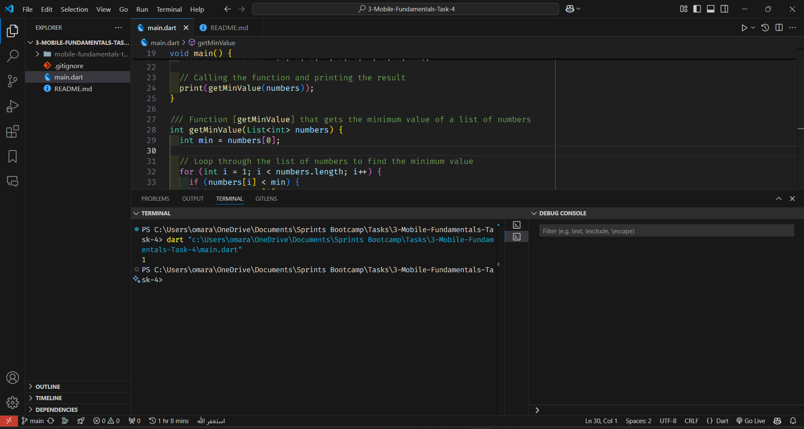

# Get the Minimum Value of a List of Numbers

This program implements a function that gets the minimum value of a list of numbers.

## Requirements

### Requirement 1

**Title:** Get the Minimum Value of a List of Numbers  
**Description:** The program should implement a function that gets the minimum value of a list of numbers. The function should take a list of integers as input and return the minimum value.

## Code Explanation

```dart
void main() {
  // List of numbers
  List<int> numbers = [1, 2, 3, 4, 5, 6, 7, 8, 9, 10];

  // Calling the function and printing the result
  print(getMinValue(numbers));
}

/// Function [getMinValue] that gets the minimum value of a list of numbers
int getMinValue(List<int> numbers) {
  int min = numbers[0];

  // Loop through the list of numbers to find the minimum value
  for (int i = 1; i < numbers.length; i++) {
    if (numbers[i] < min) {
      min = numbers[i];
    }
  }
  return min;
}
```

## Code Output

```
1
```

## Code Output Screenshot



## How to Run

1. Copy the code into a Dart file.
2. Run the Dart file using a Dart compiler or an IDE that supports Dart.
3. The output will display the minimum value of the list of numbers.
